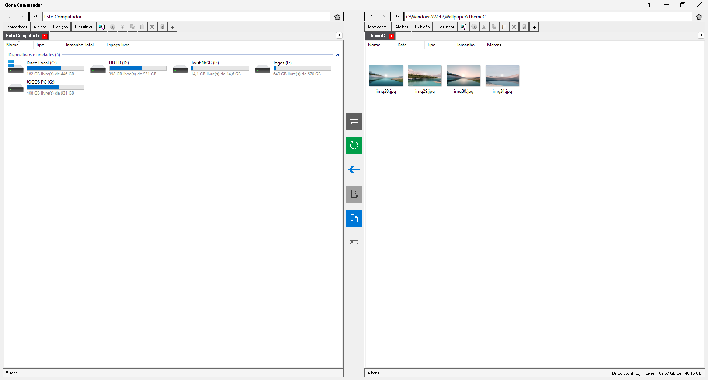

# Clone Commander

**Gestor de ficheiros com painel duplo e separadores, alimentado pelo motor nativo do Windows Explorer.**

O **Clone Commander** é uma ferramenta avançada de produtividade para Windows. Construído do zero em PowerShell e C#, ele une a interface clássica e ágil de "dois painéis" (Orthodox File Manager) com a estabilidade e compatibilidade do motor nativo do Windows Explorer.

## 💡 Legado e Filosofia de Design

O Clone Commander une conceitos consagrados de produtividade em uma única ferramenta. A verdadeira fundação deste projeto e sua referência principal é o **Windows Double Explorer (WDE)**, cujo DNA está presente na estrutura de painel duplo e, acima de tudo, no uso do motor nativo do Windows Explorer.

A organização da área de navegação — que acomoda os botões de voltar, avançar, subir, a estrela de favoritos e a barra de endereços — segue a escola de organização espacial do **Google Chrome**. O estilo visual limpo das abas e dos botões foi moldado com a estética do **Notepad++**. Por fim, a agilidade da barra central ortodoxa e das edições em massa compartilha a mesma visão do **FreeCommander XE** e **XYplorer**.

## 🚀 Principais Funcionalidades

* **Memória de Sessão (Auto-Recovery):** Fechou o programa por acidente ou precisa de interromper o trabalho para continuar depois? Não se preocupe. O Clone Commander guarda o seu progresso automaticamente em tempo real. Ao reabrir o programa, todos os seus separadores e pastas abertas são restaurados exatamente onde os deixou.
* **Sistema Avançado de Marcadores (Favoritos):** Funciona de forma semelhante ao seu navegador de internet. Clique no ícone de "Estrela" para salvar o caminho atual instantaneamente. O programa possui janelas dedicadas para o gerenciamento, permitindo criar pastas, categorizar os seus atalhos e reorganizar tudo de forma visual apenas arrastando e soltando com o mouse.
* **Navegação por Abas (Separadores):** Organize o seu fluxo de trabalho abrindo múltiplas pastas simultaneamente e de forma independente em cada um dos painéis.
* **Painel Duplo Inteligente:** Arraste e solte arquivos facilmente entre o lado esquerdo e direito. Uma seta direcional central indica sempre qual é o painel de destino.
* **Modo Turbo:** Acelere o seu fluxo de trabalho. Ao ativar o ícone "Turbo" no centro da tela, o seu teclado assume atalhos rápidos de transferência entre os painéis (`F1` para Mover, `F2` para Copiar).
* **Renomeação Sequencial de Arquivos:** Ideal para organizar grandes volumes de dados. Durante a edição do nome de um arquivo, pressione a `Seta para Baixo` para salvar e iniciar automaticamente a edição do próximo arquivo da lista. Pressione a `Seta para Cima` para o arquivo anterior.
* **Painel de Preview Flutuante:** Visualize imagens (WPF de alta qualidade), vídeos/áudios (Media Player integrado), PDFs e formatos web (via motor do Edge/WebView2), além de suporte a GIFs animados e arquivos de texto e código.
* **Backup Inteligente em Segundo Plano:** Clique no botão de Backup para criar cópias de segurança instantâneas de arquivos selecionados (adicionando sufixos automáticos como `(1)`, `(2)`) sem travar a interface.
* **Barra de Endereços Ágil:** Use `Ctrl + Backspace` na barra de endereços para apagar diretórios inteiros do caminho de uma só vez.

## 📥 Instalação e Download

O Clone Commander é um software **Portátil**. Não requer instalação e não suja o registro do seu sistema.

### Para Usuários Comuns (Recomendado)
1. Vá até a aba **[Releases]** na lateral direita desta página.
2. Baixe o arquivo ZIP da versão mais recente (ex: `CloneCommander_v1.0_EXE.zip`).
3. Extraia a pasta em qualquer lugar do seu computador e execute o `CloneCommander.exe`.

### Para Desenvolvedores (Código-Fonte)
1. Clone este repositório ou baixe o arquivo `CloneCommander.ps1`.
2. O script pode ser executado diretamente via PowerShell ou compilado para executável utilizando o `ps2exe` com os parâmetros `-NoConsole -STA -SupportOS -DPIAware -LongPaths`.

## ⌨️ Guia de Atalhos

| Atalho | Ação |
| :--- | :--- |
| **Ctrl + T** | Duplica a aba atual no mesmo painel. |
| **Ctrl + Shift + T** | Abre a pasta atual no painel oposto. |
| **Botões Laterais do Mouse** | Voltam ou avançam a navegação da pasta atual. |
| **Seta p/ Baixo** *(Ao renomear)* | Salva o nome e inicia a edição do próximo arquivo. |
| **Seta p/ Cima** *(Ao renomear)* | Salva o nome e inicia a edição do arquivo anterior. |
| **Ctrl + Backspace** *(Na barra de endereço)* | Apaga a última pasta do caminho rapidamente. |
| **F1** *(Com Modo Turbo Ligado)* | Move os itens selecionados para o painel oposto. |
| **F2** *(Com Modo Turbo Ligado)* | Copia os itens selecionados para o painel oposto. |

## 🛠️ Requisitos do Sistema
* Windows 10 ou Windows 11.
* Monitor com qualquer escala de DPI (O programa possui motor elástico *DPIAware* para não borrar em telas 4K ou escalas > 100%).

## 📄 Licença
Este projeto é distribuído sob a Licença **MIT**. Sinta-se à vontade para modificar, distribuir e utilizar conforme necessário.

Criado e desenvolvido por **Fabiopsyduck**.
